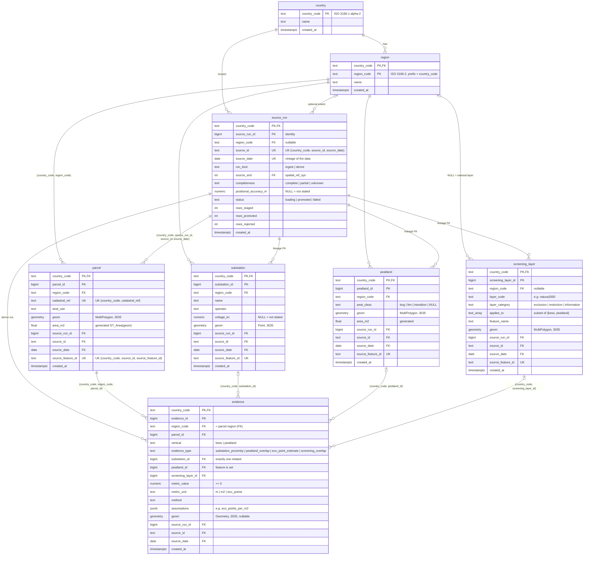
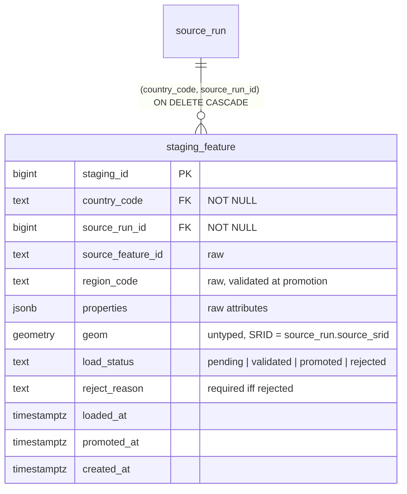

# Schema diagram

Three schemas:

| Schema         | Role                                                                                   |
|----------------|----------------------------------------------------------------------------------------|
| `iris_staging` | Raw landing zone. Features as delivered: any geometry type, in the source CRS, jsonb attributes. |
| `iris_core`    | Canonical, strictly typed, country-scoped entities. `geom` is typed and stored in EPSG:3035. |
| `iris_meta`    | Migration bookkeeping (`schema_migration`). Created by the migration runner.         |

## iris_core

`PK` / `FK` / `UK` markers show key membership. Every foreign key between business entities
includes `country_code`, so a row can only ever reference rows of its own country.



## iris_staging

`parcel`, `substation`, `peatland`, `screening_layer` share one shape:



## Data flow

```mermaid
flowchart LR
    F["fixtures/&lt;cc&gt;/*.geojson / *.csv<br/>(source CRS: 4326, 25832, 28992)"]
    -->|iris-db seed<br/>ST_SetSRID(source_srid)| S["iris_staging.*<br/>load_status = pending"]
    S -->|"promote_*()<br/>validate → reject with reason<br/>ST_Transform → 3035, upsert"| C["iris_core entities"]
    C -->|"derive_evidence()<br/>KNN / ST_Intersects in 3035"| E["iris_core.evidence"]
    E --> V["v_bess_screening<br/>v_peatland_screening"]
```

## Pilot query surface

| View                              | Grain                | Key columns |
|-----------------------------------|----------------------|-------------|
| `iris_core.v_bess_screening`      | one row per parcel   | `nearest_substation_distance_m`, `nearest_substation_voltage_kv`, `exclusion_overlap_m2`, `restriction_overlap_m2`, `constraint_layers` |
| `iris_core.v_peatland_screening`  | one row per parcel   | `peatland_overlap_m2`, `peatland_overlap_ratio`, `eco_points_estimate`, `restriction_overlap_m2`, `exclusion_overlap_m2` |

Both also expose the canonical `country_code`, `region_code`, `source_id`, `source_date`, `geom`
and the project's `uncertainty_note`, and read only the latest derive run per country/region.
